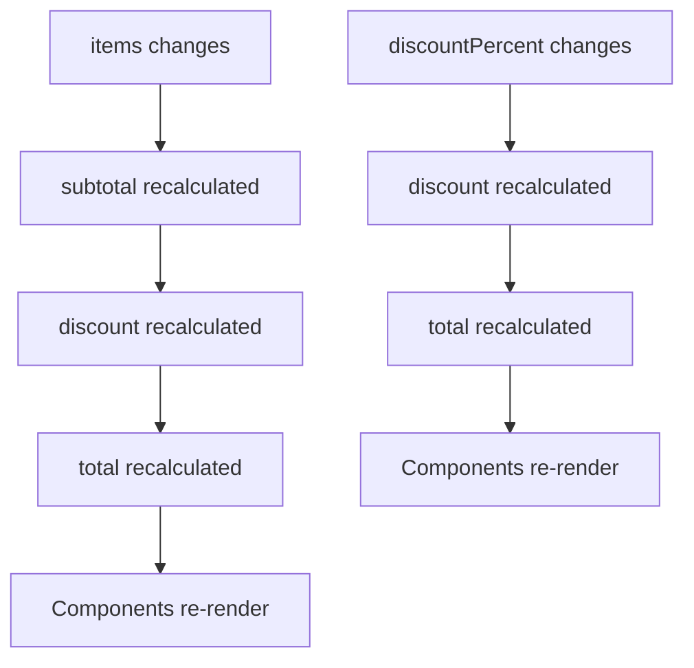

## What are Computed Values?

Computed values (also called derived state) are state properties that are calculated from other state values. In Stan.js, you create computed values using JavaScript getters.

<Info>
  Computed values are automatically readonly. Stan.js won't generate setter actions for properties defined with getters.
</Info>

## Basic Usage

### Simple Computed Property

```typescript
const { useStore } = createStore({
  firstName: 'John',
  lastName: 'Doe',
  
  get fullName() {
    return `${this.firstName} ${this.lastName}`
  },
})

function Component() {
  const { fullName } = useStore()
  // fullName = 'John Doe'
}
```

### Multiple Dependencies

```typescript
const { useStore } = createStore({
  price: 100,
  quantity: 2,
  taxRate: 0.1,
  
  get subtotal() {
    return this.price * this.quantity
  },
  
  get tax() {
    return this.subtotal * this.taxRate
  },
  
  get total() {
    return this.subtotal + this.tax
  },
})
```

## How Getters Work

Stan.js treats getter properties specially during store initialization:

### Dependency Tracking

From `src/vanilla/createStore.ts:168-194`, Stan.js tracks getter dependencies:

```typescript
storeKeys.forEach(key => {
  if (Object.getOwnPropertyDescriptor(stateRaw, key)?.get === undefined) {
    return
  }

  const dependencies = new Set<TKey>()
  const proxiedState = new Proxy(state, {
    get: (target, dependencyKey, receiver) => {
      if (!keyInObject(dependencyKey, target)) {
        return undefined
      }

      dependencies.add(dependencyKey)
      return Reflect.get(target, dependencyKey, receiver)
    },
  })

  // Call getter with proxy to track dependencies
  state[key] = Object.getOwnPropertyDescriptor(stateRaw, key)?.get?.call(proxiedState)

  // Subscribe to dependency changes
  subscribe(Array.from(dependencies))(() => {
    const newValue = Object.getOwnPropertyDescriptor(stateRaw, key)?.get?.call(state) as TState[TKey]

    state[key] = newValue
    notifyUpdates(key)
  })
})
```

### The Process

1. **Detection** - Stan.js identifies getter properties using `Object.getOwnPropertyDescriptor`
2. **Tracking** - The getter is called with a Proxy to track which state properties it accesses
3. **Subscription** - A subscription is created for all accessed dependencies
4. **Updates** - When dependencies change, the getter is recalculated and subscribers are notified

<Note>
  Getters are excluded from action generation. From `src/vanilla/createStore.ts:21-23`, properties with getters are skipped:
  
  ```typescript
  if (Object.getOwnPropertyDescriptor(stateRaw, key)?.get !== undefined) {
    return acc
  }
  ```
</Note>

## Reactive Updates

Computed values automatically update when their dependencies change:

```typescript
const { useStore, actions } = createStore({
  items: [] as Array<{ price: number; quantity: number }>,
  discountPercent: 0,
  
  get subtotal() {
    return this.items.reduce((sum, item) => 
      sum + (item.price * item.quantity), 0
    )
  },
  
  get discount() {
    return this.subtotal * (this.discountPercent / 100)
  },
  
  get total() {
    return this.subtotal - this.discount
  },
})

// When items change, subtotal, discount, and total automatically update
actions.setItems([{ price: 10, quantity: 2 }])

// When discount changes, only discount and total update
actions.setDiscountPercent(10)
```

### Subscription Flow



## Common Patterns

### Filtered Lists

```typescript
const { useStore } = createStore({
  todos: [] as Array<{ id: number; text: string; done: boolean }>,
  filter: 'all' as 'all' | 'active' | 'completed',
  
  get filteredTodos() {
    switch (this.filter) {
      case 'active':
        return this.todos.filter(todo => !todo.done)
      case 'completed':
        return this.todos.filter(todo => todo.done)
      default:
        return this.todos
    }
  },
  
  get activeCount() {
    return this.todos.filter(todo => !todo.done).length
  },
  
  get completedCount() {
    return this.todos.filter(todo => todo.done).length
  },
})
```

### Search and Filtering

```typescript
const { useStore } = createStore({
  products: [] as Array<Product>,
  searchQuery: '',
  category: 'all',
  
  get filteredProducts() {
    let results = this.products
    
    // Filter by category
    if (this.category !== 'all') {
      results = results.filter(p => p.category === this.category)
    }
    
    // Filter by search
    if (this.searchQuery) {
      const query = this.searchQuery.toLowerCase()
      results = results.filter(p => 
        p.name.toLowerCase().includes(query) ||
        p.description.toLowerCase().includes(query)
      )
    }
    
    return results
  },
  
  get resultCount() {
    return this.filteredProducts.length
  },
})
```

### Aggregations

```typescript
const { useStore } = createStore({
  transactions: [] as Array<{ amount: number; type: 'income' | 'expense' }>,
  
  get totalIncome() {
    return this.transactions
      .filter(t => t.type === 'income')
      .reduce((sum, t) => sum + t.amount, 0)
  },
  
  get totalExpenses() {
    return this.transactions
      .filter(t => t.type === 'expense')
      .reduce((sum, t) => sum + t.amount, 0)
  },
  
  get balance() {
    return this.totalIncome - this.totalExpenses
  },
  
  get averageTransaction() {
    if (this.transactions.length === 0) return 0
    const total = this.transactions.reduce((sum, t) => sum + t.amount, 0)
    return total / this.transactions.length
  },
})
```

### Formatting

```typescript
const { useStore } = createStore({
  user: {
    firstName: 'john',
    lastName: 'doe',
    email: 'JOHN@EXAMPLE.COM',
  },
  
  get displayName() {
    const { firstName, lastName } = this.user
    return `${capitalize(firstName)} ${capitalize(lastName)}`
  },
  
  get normalizedEmail() {
    return this.user.email.toLowerCase()
  },
  
  get initials() {
    const { firstName, lastName } = this.user
    return `${firstName[0]}${lastName[0]}`.toUpperCase()
  },
})
```

## Performance Considerations

### Computed Values are Cached

Getters are only recalculated when their dependencies change:

```typescript
const { useStore } = createStore({
  items: [] as Array<number>,
  filter: '',
  
  get expensiveComputation() {
    console.log('Computing...')
    // This only runs when 'items' changes
    return this.items.reduce((sum, n) => sum + n, 0)
  },
})

// This doesn't trigger recomputation
actions.setFilter('new filter')

// This triggers recomputation
actions.setItems([1, 2, 3])
```

### Avoiding Over-Computation

<Warning>
  Be careful with expensive operations in getters. They run every time dependencies change:
  
  ```typescript
  // ✗ Bad - expensive operation on every render
  get sortedItems() {
    return this.items
      .map(item => ({ ...item, score: computeComplexScore(item) }))
      .sort((a, b) => b.score - a.score)
  }
  
  // ✓ Better - cache expensive computations
  get itemsWithScores() {
    return this.items.map(item => ({
      ...item,
      score: computeComplexScore(item)
    }))
  },
  
  get sortedItems() {
    return this.itemsWithScores.sort((a, b) => b.score - a.score)
  }
  ```
</Warning>

### Selective Subscriptions

Components only re-render when the getters they use change:

```typescript
const { useStore } = createStore({
  todos: [] as Array<Todo>,
  get activeTodos() {
    return this.todos.filter(t => !t.done)
  },
  get completedTodos() {
    return this.todos.filter(t => t.done)
  },
})

function ActiveList() {
  // Only re-renders when activeTodos changes
  const { activeTodos } = useStore()
  return <ul>{activeTodos.map(...)}</ul>
}

function CompletedList() {
  // Only re-renders when completedTodos changes
  const { completedTodos } = useStore()
  return <ul>{completedTodos.map(...)}</ul>
}
```

## Chaining Computed Values

Getters can depend on other getters:

```typescript
const { useStore } = createStore({
  users: [] as Array<User>,
  searchQuery: '',
  sortBy: 'name' as 'name' | 'age' | 'score',
  
  // First level: filter
  get filteredUsers() {
    if (!this.searchQuery) return this.users
    return this.users.filter(u => 
      u.name.toLowerCase().includes(this.searchQuery.toLowerCase())
    )
  },
  
  // Second level: sort (depends on filteredUsers)
  get sortedUsers() {
    const users = [...this.filteredUsers]
    switch (this.sortBy) {
      case 'name':
        return users.sort((a, b) => a.name.localeCompare(b.name))
      case 'age':
        return users.sort((a, b) => a.age - b.age)
      case 'score':
        return users.sort((a, b) => b.score - a.score)
    }
  },
  
  // Third level: pagination (depends on sortedUsers)
  get paginatedUsers() {
    return this.sortedUsers.slice(0, 10)
  },
})
```

## Type Safety

Computed values maintain full TypeScript type inference:

```typescript
const { useStore } = createStore({
  count: 0,
  
  get doubled(): number {
    return this.count * 2
  },
  
  get label(): string {
    return `Count is ${this.count}`
  },
})

function Component() {
  const { doubled, label } = useStore()
  // doubled: number
  // label: string
}
```

## Readonly Enforcement

You cannot create actions for computed properties:

```typescript
const { actions } = createStore({
  firstName: 'John',
  get fullName() {
    return this.firstName
  },
})

// actions.setFirstName exists ✓
// actions.setFullName does NOT exist ✓
```

This is enforced at the type level:

```typescript
type Actions<TState extends object> = {
  [K in keyof TState as ActionKey<K>]: (value: TState[K]) => void
}

type RemoveReadonly<T> = Omit<T, GetReadonlyKeys<T>>
```

## Best Practices

<AccordionGroup>
  <Accordion title="Keep Getters Pure">
    Getters should not have side effects:
    
    ```typescript
    // ✗ Bad - side effects in getter
    get total() {
      console.log('Computing total')
      trackAnalytics('total_computed')
      return this.price * this.quantity
    }
    
    // ✓ Good - pure computation
    get total() {
      return this.price * this.quantity
    }
    ```
  </Accordion>
  
  <Accordion title="Avoid Expensive Operations">
    Keep getters fast, or break them into steps:
    
    ```typescript
    // ✗ Bad - expensive operation every time
    get processedData() {
      return this.rawData
        .map(expensiveTransform)
        .filter(expensiveFilter)
        .sort(expensiveSort)
    }
    
    // ✓ Good - break into cacheable steps
    get transformedData() {
      return this.rawData.map(expensiveTransform)
    },
    
    get filteredData() {
      return this.transformedData.filter(expensiveFilter)
    },
    
    get processedData() {
      return this.filteredData.sort(expensiveSort)
    }
    ```
  </Accordion>
  
  <Accordion title="Use for Derived State Only">
    Don't store what you can compute:
    
    ```typescript
    // ✗ Bad - storing derived state
    const store = createStore({
      todos: [] as Array<Todo>,
      activeCount: 0, // Redundant!
    })
    
    // ✓ Good - compute derived state
    const store = createStore({
      todos: [] as Array<Todo>,
      get activeCount() {
        return this.todos.filter(t => !t.done).length
      },
    })
    ```
  </Accordion>
  
  <Accordion title="Document Complex Getters">
    Add comments for non-obvious computations:
    
    ```typescript
    const store = createStore({
      transactions: [] as Transaction[],
      
      /**
       * Calculates the running balance by processing transactions
       * in chronological order and accounting for pending transactions
       */
      get currentBalance() {
        return this.transactions
          .filter(t => t.status !== 'pending')
          .reduce((balance, t) => 
            balance + (t.type === 'credit' ? t.amount : -t.amount),
            0
          )
      },
    })
    ```
  </Accordion>
</AccordionGroup>

## Common Pitfalls

### Circular Dependencies

<Warning>
  Avoid circular dependencies between getters:
  
  ```typescript
  // ✗ Bad - circular dependency
  const store = createStore({
    get a() {
      return this.b + 1
    },
    get b() {
      return this.a + 1 // Infinite loop!
    },
  })
  ```
</Warning>

### Mutating State in Getters

<Warning>
  Never mutate state inside getters:
  
  ```typescript
  // ✗ Bad - mutating in getter
  get sortedItems() {
    this.items.sort() // Mutates original array!
    return this.items
  }
  
  // ✓ Good - create new array
  get sortedItems() {
    return [...this.items].sort()
  }
  ```
</Warning>

## Next Steps

<CardGroup cols={2}>
  <Card title="Custom Actions" href="/api/types/custom-actions" icon="wrench">
    Create complex state update logic
  </Card>
  <Card title="Performance" href="/guides/performance" icon="gauge">
    Optimize getter performance
  </Card>
  <Card title="TypeScript" href="/guides/typescript" icon="code">
    Advanced TypeScript patterns
  </Card>
  <Card title="Testing" href="/guides/typescript" icon="flask">
    Test stores with computed values
  </Card>
</CardGroup>