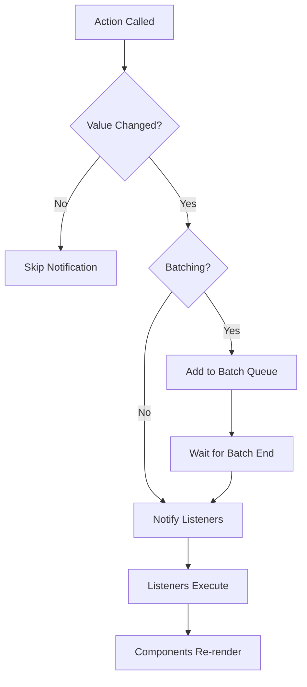

## How Subscriptions Work

Stan.js uses a sophisticated subscription system to notify components and listeners when state changes. The system is designed to be:

- **Selective** - Only subscribe to the state keys you actually use
- **Efficient** - Avoid unnecessary re-renders and callback executions
- **Flexible** - Works in React and vanilla JavaScript environments

## React Subscriptions

### Automatic Subscription Tracking

When you use the `useStore` hook, Stan.js automatically tracks which state properties you access:

```typescript
const { useStore } = createStore({
  count: 0,
  message: 'Hello',
  user: { name: 'John' },
})

function Component() {
  const { count, setCount } = useStore()
  
  // This component only subscribes to 'count'
  // Changes to 'message' or 'user' won't trigger re-renders
  return <div>{count}</div>
}
```

### How Tracking Works

From `src/createStore.ts:62-75`, Stan.js uses a Proxy to detect property access:

```typescript
return new Proxy({ ...synced, ...store.actions } as UseStoreReturn, {
  get: (target, key) => {
    if (storeKeys.includes(key as TKey) && !subscribeKeys.has(key as TKey)) {
      subscribeKeys.add(key as TKey)
      setIsInitialized(true)
    }

    if (keyInObject(key, target)) {
      return target[key]
    }

    return undefined
  },
})
```

<Info>
  The Proxy wrapper only exists during the first render. Once all accessed keys are tracked, the hook returns the actual state object for better performance.
</Info>

### useSyncExternalStore Integration

Stan.js uses React's `useSyncExternalStore` for subscriptions (`src/createStore.ts:56`):

```typescript
const synced = useSyncExternalStore(subscribeStore, getSnapshot, getSnapshot)
```

This ensures:
- **Concurrent mode safety** - Works with React 18+ concurrent features
- **SSR support** - Proper server-side rendering behavior
- **Tearing prevention** - Consistent state across component tree

## Vanilla JavaScript Subscriptions

### The subscribe Function

For non-React environments, use the `subscribe` function:

```typescript
const { subscribe, getState } = createStore({
  count: 0,
  message: 'Hello',
})

// Subscribe to specific keys
const unsubscribe = subscribe(['count'])(() => {
  console.log('Count changed:', getState().count)
})

// Later, unsubscribe
unsubscribe()
```

### Implementation Details

From `src/vanilla/createStore.ts:141-149`, the subscribe function:

```typescript
const subscribe = (keys: Array<TKey>) => (listener: VoidFunction) => {
  const compositeKey = keys.join('\0')
  listeners[compositeKey] ??= []
  listeners[compositeKey]?.push(listener)

  return () => {
    listeners[compositeKey] = listeners[compositeKey]?.filter(l => l !== listener) ?? []
  }
}
```

<Note>
  Stan.js uses the null character (`\0`) to create composite keys for multi-key subscriptions. This allows efficient lookup of all listeners that care about a specific key.
</Note>

## The Effect Hook

The `effect` function provides a reactive way to respond to state changes:

```typescript
const { effect } = createStore({
  count: 0,
  message: 'Hello',
})

// Automatically tracks accessed properties
const dispose = effect((state) => {
  console.log('Count or message changed:', state.count, state.message)
  
  // Runs when count or message changes
  document.title = `Count: ${state.count}`
})

// Clean up
dispose()
```

### Effect Implementation

From `src/vanilla/createStore.ts:207-227`, effects use dependency tracking:

```typescript
const effect = (run: (state: TState) => void) => {
  const keysToListen = new Set<TKey>()

  run(
    new Proxy(state, {
      get: (target, key) => {
        if (storeKeys.includes(key as TKey)) {
          keysToListen.add(key as TKey)
        }

        if (keyInObject(key, target)) {
          return target[key]
        }

        return undefined
      },
    }),
  )

  return subscribe(keysToListen.size === 0 ? storeKeys : Array.from(keysToListen))(() => run(state))
}
```

### React Effect Hook

For React components, use `useStoreEffect`:

```typescript
const { useStoreEffect } = createStore({
  count: 0,
})

function Component() {
  useStoreEffect((state) => {
    console.log('Count changed:', state.count)
    
    // Side effects here
    document.title = `Count: ${state.count}`
  })
  
  return <div>...</div>
}
```

<Warning>
  `useStoreEffect` runs on mount and whenever tracked state changes. Be careful with side effects that shouldn't run on every change.
</Warning>

## Notification System

### When Notifications Happen

Notifications are triggered when state values change (`src/vanilla/createStore.ts:57-69`):

```typescript
const notifyUpdates = (keyToNotify: TKey) => {
  Object.entries(listeners).forEach(([compositeKey, listenersArray]) => {
    if (compositeKey.split('\0').every(key => key !== keyToNotify)) {
      return
    }

    if (isBatching) {
      return batchedKeys.add(compositeKey)
    }

    listenersArray.forEach(listener => listener(state[compositeKey as TKey]))
  })
}
```

### Notification Flow



## Batched Notifications

### Why Batching Matters

Without batching, multiple state updates trigger multiple notifications:

```typescript
const { actions } = createStore({
  firstName: '',
  lastName: '',
  email: '',
})

function Component() {
  const { firstName, lastName, email } = useStore()
  
  // This component re-renders 3 times!
  const updateUser = () => {
    actions.setFirstName('John')
    actions.setLastName('Doe')
    actions.setEmail('john@example.com')
  }
}
```

### Using batchUpdates

```typescript
function Component() {
  const { firstName, lastName, email } = useStore()
  const { batchUpdates } = store
  
  // This component re-renders once!
  const updateUser = () => {
    batchUpdates(() => {
      actions.setFirstName('John')
      actions.setLastName('Doe')
      actions.setEmail('john@example.com')
    })
  }
}
```

### Batch Implementation

From `src/vanilla/createStore.ts:71-82`:

```typescript
const batchUpdates = (callback: VoidFunction) => {
  try {
    batchedKeys.clear()
    isBatching = true
    callback()
  } finally {
    batchedKeys.forEach(key => {
      listeners[key]?.forEach(listener => listener(state[key as TKey]))
    })
    isBatching = false
  }
}
```

<Info>
  Custom actions automatically batch all updates, so you don't need to manually call `batchUpdates` when using them.
</Info>

## Composite Key Subscriptions

Stan.js allows subscribing to multiple keys simultaneously:

```typescript
const { subscribe } = createStore({
  firstName: 'John',
  lastName: 'Doe',
  age: 30,
})

// Listen to firstName OR lastName changes
subscribe(['firstName', 'lastName'])(() => {
  console.log('Name changed!')
})

// Age changes won't trigger this listener
```

Keys are joined with null bytes internally:

```typescript
const compositeKey = keys.join('\0') // 'firstName\0lastName'
```

## Synchronizers and Subscriptions

Synchronizers integrate with the subscription system for external state sources:

```typescript
const storage = (initial: number) => ({
  value: initial,
  getSnapshot: (key: string) => {
    const value = localStorage.getItem(key)
    return value ? JSON.parse(value) : null
  },
  update: (value: number, key: string) => {
    localStorage.setItem(key, JSON.stringify(value))
  },
  subscribe: (update: (value: number) => void, key: string) => {
    window.addEventListener('storage', (event) => {
      if (event.key === key && event.newValue) {
        update(JSON.parse(event.newValue))
      }
    })
  },
})

const { useStore } = createStore({
  count: storage(0),
})
```

From `src/vanilla/createStore.ts:129-132`, synchronizers hook into listeners:

```typescript
listeners[key]?.push(newValue => value.update(newValue, key))
value.subscribe?.(getAction(key as TKey), key)
```

## Performance Optimizations

### Selective Subscriptions

Only subscribe to what you use:

```typescript
function CountDisplay() {
  // Only subscribes to 'count'
  const { count } = useStore()
  return <div>{count}</div>
}

function MessageDisplay() {
  // Only subscribes to 'message'
  const { message } = useStore()
  return <div>{message}</div>
}
```

### Equality Checks

Stan.js skips notifications when values don't change:

```typescript
// From src/vanilla/createStore.ts:42-43
if (equal(state[key], value)) {
  return
}
```

### Memoized Snapshots

For React, snapshots are memoized to prevent unnecessary renders (`src/createStore.ts:21-35`):

```typescript
const getState = () => {
  let oldState: TState

  return () => {
    const currentState = { ...store.getState() }

    if (equal(oldState, currentState)) {
      return oldState // Same reference = no re-render
    }

    oldState = currentState
    return currentState
  }
}
```

## Common Patterns

### Global State Listener

```typescript
const { effect } = createStore({
  theme: 'light',
  user: null,
})

// Log all state changes
effect((state) => {
  console.log('State changed:', state)
})
```

### Cleanup on Unmount

```typescript
function Component() {
  const { effect } = store
  
  useEffect(() => {
    const dispose = effect((state) => {
      // React to changes
    })
    
    return dispose // Cleanup
  }, [])
}
```

### Conditional Subscriptions

```typescript
function Component({ shouldTrack }: { shouldTrack: boolean }) {
  const { useStoreEffect } = store
  
  useStoreEffect(
    (state) => {
      if (shouldTrack) {
        trackEvent('count_changed', { count: state.count })
      }
    },
    [shouldTrack]
  )
}
```

## Best Practices

<AccordionGroup>
  <Accordion title="Subscribe to Minimal Keys">
    Only access state properties you actually need:
    
    ```typescript
    // ✗ Bad - subscribes to all state
    const store = useStore()
    return <div>{store.count}</div>
    
    // ✓ Good - subscribes only to count
    const { count } = useStore()
    return <div>{count}</div>
    ```
  </Accordion>
  
  <Accordion title="Clean Up Subscriptions">
    Always clean up manual subscriptions:
    
    ```typescript
    useEffect(() => {
      const unsubscribe = subscribe(['count'])(() => {
        // Handle change
      })
      
      return unsubscribe // Important!
    }, [])
    ```
  </Accordion>
  
  <Accordion title="Batch Related Updates">
    Use batching for multiple related state changes:
    
    ```typescript
    // ✗ Bad - multiple notifications
    actions.setLoading(true)
    actions.setError(null)
    actions.setData(result)
    
    // ✓ Good - single notification
    batchUpdates(() => {
      actions.setLoading(true)
      actions.setError(null)
      actions.setData(result)
    })
    ```
  </Accordion>
  
  <Accordion title="Use Effects Sparingly">
    Effects run on every change. Use them only when necessary:
    
    ```typescript
    // ✗ Bad - effect for simple logging
    useStoreEffect((state) => {
      console.log(state.count)
    })
    
    // ✓ Good - regular useEffect
    const { count } = useStore()
    useEffect(() => {
      console.log(count)
    }, [count])
    ```
  </Accordion>
</AccordionGroup>

## Next Steps

<CardGroup cols={2}>
  <Card title="Computed Values" href="/concepts/computed-values" icon="function">
    Learn about derived state with getters
  </Card>
  <Card title="Custom Actions" href="/api/types/custom-actions" icon="wrench">
    Create custom actions with auto-batching
  </Card>
  <Card title="Performance" href="/guides/performance" icon="gauge">
    Optimize your Stan.js applications
  </Card>
  <Card title="Persistence" href="/guides/persistence" icon="database">
    Persist state with Synchronizers
  </Card>
</CardGroup>